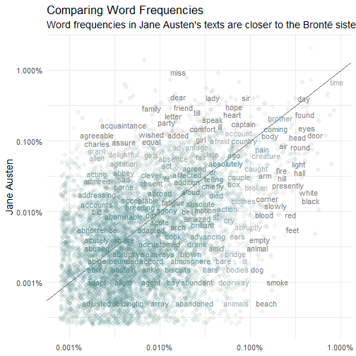
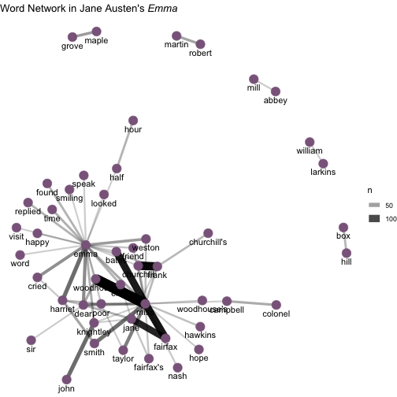
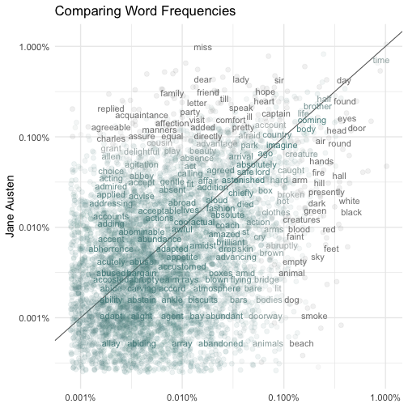
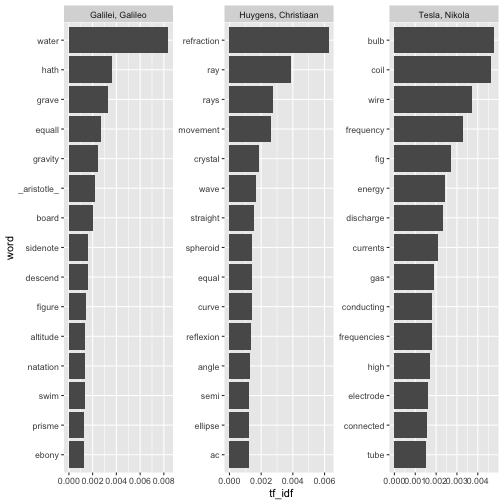
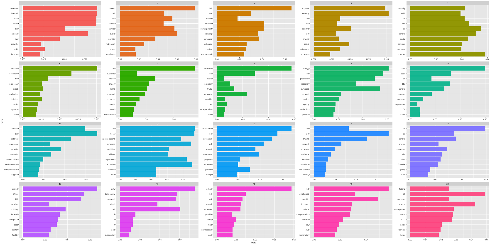

Applied Data Science
========================================================
author: Text Mining
date: 09.07.2019
autosize: false
width: 1920
height: 1080
font-family: 'Arial'
css: mySlideTemplate.css

Credits
======
* The main parts of this lecture and the R examples follow from the fantastic tutorials provided by

* http://juliasilge.com/blog/Life-Changing-Magic/

* http://juliasilge.com/blog/Term-Frequency-tf-idf/

* https://www.tidytextmining.com/index.html

* https://www.hvitfeldt.me/blog/text-classification-with-tidymodels/

The tidytext package
====
As described by Hadley Wickham, `tidy` data has a specific structure:
* each variable is a column
* each observation is a row
* each type of observational unit is a table

The goal of the `tidytext` package is to provide functions and supporting data sets to allow
* conversion of text to and from tidy formats
* to switch seamlessly between tidy tools and existing text mining packages

En passant we benefit from the familiar pipe structure

A first minimal example: Getting all words from Jane Austen's novels
====


```r
original_books <- austen_books() 

original_books
```

```
# A tibble: 73,422 x 2
   text                  book               
 * <chr>                 <fct>              
 1 SENSE AND SENSIBILITY Sense & Sensibility
 2 ""                    Sense & Sensibility
 3 by Jane Austen        Sense & Sensibility
 4 ""                    Sense & Sensibility
 5 (1811)                Sense & Sensibility
 6 ""                    Sense & Sensibility
 7 ""                    Sense & Sensibility
 8 ""                    Sense & Sensibility
 9 ""                    Sense & Sensibility
10 CHAPTER 1             Sense & Sensibility
# ... with 73,412 more rows
```

***


```r
original_books %>%
  unnest_tokens(word, text) -> tidy_books

tidy_books
```

```
# A tibble: 725,055 x 2
   book                word       
   <fct>               <chr>      
 1 Sense & Sensibility sense      
 2 Sense & Sensibility and        
 3 Sense & Sensibility sensibility
 4 Sense & Sensibility by         
 5 Sense & Sensibility jane       
 6 Sense & Sensibility austen     
 7 Sense & Sensibility 1811       
 8 Sense & Sensibility chapter    
 9 Sense & Sensibility 1          
10 Sense & Sensibility the        
# ... with 725,045 more rows
```

Retaining information by annotating beforehand
=====

```r
austen_books() %>%
        group_by(book) %>%
        mutate(linenumber = row_number(),
               chapter = cumsum(str_detect(text,
                                           regex("^chapter [\\divxlc]",                                                 			ignore_case = T)
                                           )
                                )
               ) %>%
        ungroup() -> original_books

head(original_books)
```

```
# A tibble: 6 x 4
  text                  book                linenumber chapter
  <chr>                 <fct>                    <int>   <int>
1 SENSE AND SENSIBILITY Sense & Sensibility          1       0
2 ""                    Sense & Sensibility          2       0
3 by Jane Austen        Sense & Sensibility          3       0
4 ""                    Sense & Sensibility          4       0
5 (1811)                Sense & Sensibility          5       0
6 ""                    Sense & Sensibility          6       0
```

***


```r
original_books %>%
  unnest_tokens(word, text) -> tidy_books

head(tidy_books)
```

```
# A tibble: 6 x 4
  book                linenumber chapter word       
  <fct>                    <int>   <int> <chr>      
1 Sense & Sensibility          1       0 sense      
2 Sense & Sensibility          1       0 and        
3 Sense & Sensibility          1       0 sensibility
4 Sense & Sensibility          3       0 by         
5 Sense & Sensibility          3       0 jane       
6 Sense & Sensibility          3       0 austen     
```

A not so helpful word count
=====


```r
tidy_books %>%
        count(word, sort = TRUE)
```

```
# A tibble: 14,520 x 2
   word      n
   <chr> <int>
 1 the   26351
 2 to    24044
 3 and   22515
 4 of    21178
 5 a     13408
 6 her   13055
 7 i     12006
 8 in    11217
 9 was   11204
10 it    10234
# ... with 14,510 more rows
```

What should we do next?

Stop words to the resuce!
====

* Since the data is in one-word-per-row format, we can just use our `dplyr` skills
* For example, we can remove stop words with an `anti_join`
* tidytext provides `stop_words` for English texts


```r
data("stop_words")
tidy_books %>%
anti_join(stop_words) -> tidy_books
```


***


```r
tidy_books %>%
        count(word, sort = TRUE)
```

```
# A tibble: 13,914 x 2
   word       n
   <chr>  <int>
 1 miss    1855
 2 time    1337
 3 fanny    862
 4 dear     822
 5 lady     817
 6 sir      806
 7 day      797
 8 emma     787
 9 sister   727
10 house    699
# ... with 13,904 more rows
```

Super-short sentiment analysis
====

* The tidytext package provides multiple sentiment lexicons
* The standard option offers numeric values


```r
get_sentiments()
```

```
# A tibble: 2,477 x 2
   word       value
   <chr>      <dbl>
 1 abandon       -2
 2 abandoned     -2
 3 abandons      -2
 4 abducted      -2
 5 abduction     -2
 6 abductions    -2
 7 abhor         -3
 8 abhorred      -3
 9 abhorrent     -3
10 abhors        -3
# ... with 2,467 more rows
```

***

* The bing dictionary is binary


```r
get_sentiments("bing") -> bing

bing
```

```
# A tibble: 6,786 x 2
   word        sentiment
   <chr>       <chr>    
 1 2-faces     negative 
 2 abnormal    negative 
 3 abolish     negative 
 4 abominable  negative 
 5 abominably  negative 
 6 abominate   negative 
 7 abomination negative 
 8 abort       negative 
 9 aborted     negative 
10 aborts      negative 
# ... with 6,776 more rows
```

* Sentiment analysis boils down to an `inner_join`


Programming Task
====

* Examine how sentiment changes changes during each novel
* Find a sentiment score for each word using the Bing lexicon
* Count the number of positive and negative words in defined sections of each novel
* Plot sentiment scores across the plot trajectory of each novel

Single words may not be enough
====

* Lots of useful work can be done by tokenizing at the word level, but sometimes it is useful or necessary to look at different units of text
* For example, some sentiment analysis algorithms look beyond only unigrams (i.e. single words) to try to understand the sentiment of a sentence as a whole
* Example: "I am not having a good day."
* The negation create a negative sentiment despite the positive word good!
* To circumvent such pitfalls we want to tokenize on the sentence level
* Afterwards special packages like `sentimentr` can be used to detect sentence sentiment

Tokeninzing Sentences: A Jane Austen Quote Generator
====

```r
austen_books() %>% 
        group_by(book) %>% 
        unnest_tokens(sentence, text, token = "sentences") %>% 
        ungroup() %>%
        filter(stringr::str_detect(sentence, pattern = " ")) -> austen_sentences

x = 1:length(austen_sentences$book)
```


***


```r
austen_sentences$sentence[sample(x,5)]
```

```
[1] "ellison, and that, as i have been since informed, is the name of miss grey's guardian.\""                                                                                                                                                                                                                                                                                                                                                                                                                                                                                                                                                                                                     
[2] "fanny he must give up."                                                                                                                                                                                                                                                                                                                                                                                                                                                                                                                                                                                                                                                                       
[3] "blaize castle remained her only comfort; towards that, she still looked at intervals with pleasure; though rather than be disappointed of the promised walk, and especially rather than be thought ill of by the tilneys, she would willingly have given up all the happiness which its walls could supply--the happiness of a progress through a long suite of lofty rooms, exhibiting the remains of magnificent furniture, though now for many years deserted--the happiness of being stopped in their way along narrow, winding vaults, by a low, grated door; or even of having their lamp, their only lamp, extinguished by a sudden gust of wind, and of being left in total darkness."
[4] "i have the highest opinion in the world of edward's heart."                                                                                                                                                                                                                                                                                                                                                                                                                                                                                                                                                                                                                                   
[5] "she was so eager to have them drawn that i could not refuse; but there is no making children of three or four years old stand still you know; nor can it be very easy to take any likeness of them, beyond the air and complexion, unless they are coarser featured than any of mama's children ever were."                                                                                                                                                                                                                                                                                                                                                                                   
```

Programming Task
=====

* Get the list of negative words from the Bing lexicon
* Make a dataframe of how many words are in each chapter so we can normalize for the length of chapters
* Find the number of negative words in each chapter and divide by the total words in each chapter
* Which chapter has the highest proportion of negative words?

Networks of Words
=====
* Another function in `widyr` is `pairwise_count`, which counts pairs of items that occur together within a group.

* Let's count the words that occur together in the lines of Pride and Prejudice.


```r
pride_prejudice_words <- tidy_books %>%
        filter(book == "Pride & Prejudice")

word_cooccurences <- pride_prejudice_words %>%
        widyr::pairwise_count(word, linenumber, sort = TRUE)

word_cooccurences
```

```
# A tibble: 101,100 x 3
   item1     item2         n
   <chr>     <chr>     <dbl>
 1 catherine lady         87
 2 lady      catherine    87
 3 miss      bingley      68
 4 bingley   miss         68
 5 miss      bennet       65
 6 bennet    miss         65
 7 miss      darcy        46
 8 darcy     miss         46
 9 william   sir          35
10 sir       william      35
# ... with 101,090 more rows
```

***


```r
word_cooccurences %>%
  filter(item1 == "darcy")
```

```
# A tibble: 750 x 3
   item1 item2         n
   <chr> <chr>     <dbl>
 1 darcy miss         46
 2 darcy elizabeth    23
 3 darcy bingley      15
 4 darcy looked        9
 5 darcy replied       8
 6 darcy love          8
 7 darcy friend        8
 8 darcy pemberley     8
 9 darcy cried         7
10 darcy eyes          7
# ... with 740 more rows
```

Plotting the word network
====

It is nice to plot a network of co-occuring words.


```r
set.seed(1813)
word_cooccurences %>%
        filter(n >= 10) %>%
        graph_from_data_frame() %>%
        ggraph(layout = "fr") +
        geom_edge_link(aes(edge_alpha = n, edge_width = n)) +
        geom_node_point(color = "darkslategray4", size = 5) +
        geom_node_text(aes(label = name), vjust = 1.8) +
        ggtitle(expression(paste("Word Network in Jane Austen's ", 
                                 italic("Pride and Prejudice")))) +
        theme_void() -> g1
```

***


```r
emma_words <- tidy_books %>%
        filter(book == "Emma")
word_cooccurences <- emma_words %>%
        widyr::pairwise_count(word, linenumber, sort = TRUE)
word_cooccurences %>%
        filter(n >= 10) %>%
        graph_from_data_frame() %>%
        ggraph(layout = "fr") +
        geom_edge_link(aes(edge_alpha = n, edge_width = n)) +
        geom_node_point(color = "plum4", size = 5) +
        geom_node_text(aes(label = name), vjust = 1.8) +
        ggtitle(expression(paste("Word Network in Jane Austen's ", 
                                 italic("Emma")))) +
        theme_void() -> g2
```

Networks
====


```r
g1
```



***


```r
g2
```




Term Frequency Analysis
====

* A common task in text mining is to look at word frequencies and to compare frequencies across different texts
* We can do this using tidy data principles pretty smoothly. We already have Jane Austen's works; let's get another text to compare to.
* `gutenbergr` allows to download full texts from project Gutenberg through `R`
* Let’s look at some science fiction and fantasy novels by H.G. Wells, who lived in the late 19th and early 20th centuries
_The Time Machine_, _The War of the Worlds_, _The Invisible Man_, and _The Island of Doctor Moreau_.

***


```r
hgwells <- gutenberg_download(c(35, 36, 5230, 159))

hgwells %>%
   unnest_tokens(word, text) %>%
   anti_join(stop_words) -> tidy_hgwells
```

Comparing Word Frequency through ratios
====


```r
tidy_hgwells %>%
  mutate(word = str_extract(word, "[a-z]+")) %>%
  count(word) %>%
  rename(HGWells = n) %>%
  inner_join(count(tidy_books, word)) %>%
  rename(Austen = n) %>%
  mutate(HGWells = HGWells / sum(HGWells),
         Austen = Austen / sum(Austen)) %>%
  ungroup() -> frequency
```

***


```r
frequency %>%
  gather(author, freq, HGWells, Austen) %>%
  group_by(author) %>%
  arrange(-freq) %>%
  head(10)
```

```
# A tibble: 10 x 3
# Groups:   author [2]
   word   author     freq
   <chr>  <chr>     <dbl>
 1 miss   Austen  0.0116 
 2 time   HGWells 0.00909
 3 time   Austen  0.00837
 4 people HGWells 0.00605
 5 door   HGWells 0.00523
 6 dear   Austen  0.00515
 7 lady   Austen  0.00512
 8 sir    Austen  0.00505
 9 day    Austen  0.00499
10 heard  HGWells 0.00497
```


Comparing Word Frequencies throug ratios
====


```r
ggplot(frequency, aes(x = HGWells, y = Austen, color = abs(Austen - HGWells))) +
        geom_abline(color = "gray40") +
        geom_jitter(alpha = 0.1, size = 2.5, width = 0.4, height = 0.4) +
        geom_text(aes(label = word), check_overlap = TRUE, vjust = 1.5) +
        scale_x_log10(labels = percent_format()) +
        scale_y_log10(labels = percent_format()) +
        scale_color_gradient(limits = c(0, 0.001), low = "darkslategray4", high = "gray75") +
        theme_minimal(base_size = 14) +
        theme(legend.position="none") +
        labs(title = "Comparing Word Frequencies",
             y = "Jane Austen", x = NULL) -> g
```

***


```r
g
```



Limits of term frequency
====

* One of our key text mining questions was to assess what a document is about
    * Can we do this by looking at the words that make up the document?
* One way to approach how important a word can be is its term frequency (_tf_), how frequently a word occurs in a document.
    * There are words in a document, though, that occur many times but may not be important; in English, these are probably words like "the", "is", "of", and so forth.
    * A list of stop words is not a sophisticated approach to adjusting term frequency for commonly used words as it is possible that some of these words might be more important in some documents than others.

Inverse Term Frequency
=====

* Another approach is to look at a term's inverse document frequency (_idf_)

* _Idf_ decreases the weight for commonly used words and increases the weight for words that are not used very much in a collection of documents

* This can be combined with term frequency to calculate a term's _tf-idf_, the frequency of a term adjusted for how rarely it is used

***

* The inverse document frequency for any given term is defined as

$$idf(term) = ln \left( \frac{n_{docs}}{n_{docs \quad containing \quad term}} \right) $$

Super quick physics example
====


```r
physics <- gutenberg_download(c(37729, 14725, 13476),
                              meta_fields = "author")

physics %>%
        unnest_tokens(word, text) %>%
        count(author, word, sort = TRUE) %>%
        ungroup() -> physics_words

physics_words %>%
        bind_tf_idf(word, author, n) -> physics_words

physics_words %>%
  group_by(author) %>%
  arrange(desc(tf_idf)) %>%
  top_n(15, tf_idf) %>%
    ungroup() %>%
  mutate(word = reorder(word, tf_idf)) %>%
  ggplot(aes(x=word, y=tf_idf))+
  geom_col() + 
  coord_flip() + 
  facet_wrap(~author, scales="free") -> g
```

***


```r
g
```



Supervised Learning with textual data
====

Congressional Bill Dataset:

A sample dataset containing labeled bills from the United States Congress, compiled by Professor John D. Wilkerson at the University of Washington, Seattle and E. Scott Adler at the University of Colorado, Boulder.

Can we train a classifier to predict which topic a bill covers?


```r
USCongress = read.csv2("USCongress.csv")

major_topics <- tibble(
  major = c(1:10, 12:21, 99),
  label = c("Macroeconomics", "Civil rights, minority issues, civil liberties",
            "Health", "Agriculture", "Labor and employment", "Education", "Environment",
            "Energy", "Immigration", "Transportation", "Law, crime, family issues",
            "Social welfare", "Community development and housing issues",
            "Banking, finance, and domestic commerce", "Defense",
            "Space, technology, and communications", "Foreign trade",
            "International affairs and foreign aid", "Government operations",
            "Public lands and water management", "Other, miscellaneous")
)
```

***

* Set up data and test/train split


```r
USCongress %>%
    mutate(text = as.character(text)) %>%
    left_join(major_topics) %>%
  select(text, label) %>%
  mutate(label = as.factor(label)) -> congress

congress_split <- initial_split(congress, strata = "label", p = 0.75)
train_data <- training(congress_split)
test_data <- testing(congress_split)
```

Text Recipes
====


```r
text_rec <- recipe(label ~ ., data = train_data) %>%
  step_filter(text != "") %>%
  step_tokenize(text) %>%
  step_tokenfilter(text, min_times = 11) %>%
  step_tf(text) %>%
  prep(training = train_data)

text_train_data <- juice(text_rec)
text_test_data  <- bake(text_rec, test_data)

str(text_train_data, list.len = 10)
```

```
Classes 'tbl_df', 'tbl' and 'data.frame':	3337 obs. of  782 variables:
 $ label                     : Factor w/ 20 levels "Agriculture",..: 9 9 9 13 2 9 9 9 5 3 ...
 $ tf_text_1                 : num  0 0 0 0 0 0 0 0 0 0 ...
 $ tf_text_10                : num  0 0 0 0 0 0 0 0 0 0 ...
 $ tf_text_11                : num  0 0 0 0 0 0 0 0 0 0 ...
 $ tf_text_18                : num  0 0 0 0 0 0 0 0 0 0 ...
 $ tf_text_1934              : num  0 0 0 0 0 0 0 0 0 0 ...
 $ tf_text_1961              : num  0 0 0 0 0 0 0 0 0 0 ...
 $ tf_text_1965              : num  0 0 0 0 0 0 0 0 0 0 ...
 $ tf_text_1974              : num  0 0 0 0 0 0 0 0 0 0 ...
 $ tf_text_1986              : num  0 0 0 0 0 0 0 0 0 0 ...
  [list output truncated]
```

***
Train a Random Forest Model


```r
rf_model <- rand_forest(trees = 20,
                        mode = "classification") %>%
  set_engine("randomForest")
rf_model
```

```
Random Forest Model Specification (classification)

Main Arguments:
  trees = 20

Computational engine: randomForest 
```

```r
text_model <- rf_model %>%
  fit(label ~ ., data = text_train_data)
```

Evaluation
====


```r
eval_tibble = predict(text_model, text_test_data, type = "class")
eval_tibble$label = text_test_data$label

eval_tibble %>%
  accuracy(truth = label, estimate =  .pred_class )
```

```
# A tibble: 1 x 3
  .metric  .estimator .estimate
  <chr>    <chr>          <dbl>
1 accuracy multiclass     0.645
```

***


```r
eval_tibble %>%
  mutate(combined = paste(substr(label,1,10), substr(.pred_class,1,5), sep =" | ")) %>%
  group_by(combined) %>%
  tally() %>%
  arrange(-n) %>% 
  print(n=20)
```

```
# A tibble: 191 x 2
   combined                 n
   <chr>                <int>
 1 Health | Healt         120
 2 Public lan | Publi      98
 3 Foreign tr | Forei      91
 4 Government | Gover      58
 5 "Law, crime | Law, "    48
 6 Banking, f | Banki      44
 7 Defense | Defen         36
 8 Education | Educa       35
 9 Macroecono | Macro      34
10 Labor and  | Labor      28
11 Transporta | Trans      22
12 Energy | Energ          21
13 Environmen | Envir      21
14 Agricultur | Agric      15
15 Government | Publi      14
16 Internatio | Inter      13
17 Social wel | Socia      12
18 Defense | Publi          9
19 Environmen | Publi       9
20 Law, crime | Healt       9
# ... with 171 more rows
```


Topic Modelling
====

* In text mining, we often have collections of documents, such as blog posts or news articles, that we’d like to divide into natural groups so that we can understand them separately

* Topic modeling is a method for unsupervised classification of such documents, similar to clustering on numeric data, which finds natural groups of items even when we’re not sure what we’re looking for

Latent Dirichlet Allocation (LDA)
====

* Latent Dirichlet allocation is one of the most common algorithms for topic modeling. We can understand it as being guided by two principles.

    * Every document is a mixture of topics. We imagine that each document may contain words from several topics in particular proportions. For example, in a two-topic model we could say “Document 1 is 90% topic A and 10% topic B, while Document 2 is 30% topic A and 70% topic B.”
    
    * Every topic is a mixture of words. For example, we could imagine a two-topic model of American news, with one topic for “politics” and one for “entertainment.” The most common words in the politics topic might be “President”, “Congress”, and “government”, while the entertainment topic may be made up of words such as “movies”, “television”, and “actor”. Importantly, words can be shared between topics; a word like “budget” might appear in both equally.

***

Two main ouputs emerge from an LDA

* Word-topic probabilities: The tidytext package provides this method for extracting the per-topic-per-word probabilities, called beta, from the model

* Document-topic probabilities: Besides estimating each topic as a mixture of words, LDA also models each document as a mixture of topics
We want to examine the per-document-per-topic probabilities, called gamma.


LDA on US Congress Data
====
*Prepare term document matrix and run LDA


```r
congress %>%
  mutate(documentID = row_number()) %>%
  select(text, documentID) %>%
  unnest_tokens(word, text) %>%
  anti_join(stop_words) %>%
  count(documentID, word, sort = TRUE) %>%
  cast_dtm(documentID, word, n) -> tdm

congress_lda <- topicmodels::LDA(tdm,
                                 k = 20, 
                                 control = list(seed = 1234))
congress_lda
```

```
A LDA_VEM topic model with 20 topics.
```

***
* Explore topics


```r
congress_topics <- tidy(congress_lda, matrix = "beta")
congress_topics %>%
  group_by(topic) %>%
  top_n(1, beta)
```

```
# A tibble: 20 x 3
# Groups:   topic [20]
   topic term         beta
   <int> <chr>       <dbl>
 1     9 energy     0.0613
 2     2 health     0.0788
 3    18 federal    0.117 
 4     4 security   0.103 
 5    14 act        0.106 
 6    10 united     0.149 
 7    16 united     0.0665
 8     5 program    0.0581
 9     6 national   0.101 
10     3 bill       0.0659
11     7 bill       0.0555
12    11 bill       0.0711
13    12 bill       0.0473
14    15 bill       0.0590
15    19 bill       0.0571
16    20 bill       0.0490
17    13 assistance 0.0689
18     1 revenue    0.0900
19    17 duty       0.113 
20     8 establish  0.145 
```

Results
====


```r
congress_topics %>%
  group_by(topic) %>%
  top_n(10, beta) %>%
  ungroup() %>%
  arrange(topic, -beta) -> congress_top_terms

congress_top_terms %>%
  mutate(term = reorder(term, beta)) %>%
  ggplot(aes(term, beta, fill = factor(topic))) +
  geom_col(show.legend = FALSE) +
  facet_wrap(~ topic, scales = "free") +
  coord_flip() -> g
```

***


```r
congress_top_terms
```

```
# A tibble: 200 x 3
   topic term       beta
   <int> <chr>     <dbl>
 1     1 revenue  0.0900
 2     1 internal 0.0895
 3     1 1986     0.0889
 4     1 code     0.0884
 5     1 amend    0.0786
 6     1 bill     0.0509
 7     1 tax      0.0447
 8     1 credit   0.0265
 9     1 provide  0.0221
10     1 income   0.0213
# ... with 190 more rows
```

Visualization
====


```r
g
```



Text Mining Overview
====


